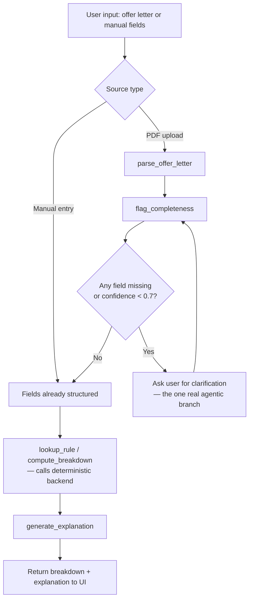

# Financial Clarity — Agent Architecture (Phase 1)

## Core constraint
The LLM never does arithmetic. All PF/HRA/tax math lives in the deterministic backend (`backend/rule_schema.sql`, `/api/v1/breakdown`). The agent layer only parses input, decides when to ask for clarification, and narrates results.

## Orchestrator flow

## Tools (updated to match the real backend, `backend/` — see note below)

| Tool | Input | Output | Notes |
|---|---|---|---|
| `parse_offer_letter` | PDF/text | structured `CTCBreakup` fields + per-field confidence | Calls `POST /parse-fields` to validate once parsed; a `422` with `missing_fields`/`malformed_fields` is what should trigger the clarification branch below |
| `flag_completeness` | structured fields | completeness score + list of missing/low-confidence fields | Backend exposes `GET /completeness-scope` (static covered/not-covered list) to ground this — simplest tool, candidate for role 5 to own if the team is short a person |
| `lookup_rule` | `rule_id`, `fy` | rule text/value | Thin wrapper over `GET /rule/{rule_id}?fy=...`; powers the audit-trail click-through |
| `compute_breakdown` | `CTCBreakup` + `regime` + `fy` | calls `POST /breakdown` | Orchestrator never computes numbers itself; also returns `red_flags` (see `detect_red_flags` in `backend/app/engine.py`) — not in the original Phase 1 sketch, folded in from the real backend |
| `compute_regime_comparison` | `gross_salary`, `deductions_claimed`, HRA inputs, `fy` | calls `POST /regime-comparison` | New vs. original plan: backend computes the recommended regime and per-deduction tax-saved breakdown directly, so `generate_explanation` can narrate "why" without inferring it itself |
| `generate_explanation` | breakdown/comparison response | natural-language text | Narrates numbers already computed; should cite `rule_id`s via `lookup_rule` rather than inventing rule descriptions, per `backend/app/main.py`'s own contract |

## The one real agentic decision point

When `flag_completeness` reports a missing field or confidence below threshold (0.7, matching the API contract's `needs_clarification`), the orchestrator stops and asks the user rather than guessing a default. This is the only branch in the system that isn't a fixed pipeline step — everywhere else, the flow is deterministic and linear.

## What's explicitly out of scope for Phase 1
- No tool is actually implemented — this is architecture only, matching Phase 1's "design only" scope for AI (per the team-split table, roles 3/4 pair on this design and don't start real building until Phase 2, gated on backend's schema/contract above being locked first).
- `parse_offer_letter`'s real PDF-parsing logic and `flag_completeness`'s real confidence-threshold wiring are Phase 3 deliverables.

## Update (2026-09-05): real backend arrived ahead of schedule
A working FastAPI backend ("Offer Decoder", from `WEHACK.zip`) was dropped in — see `backend/` and `docs/backend-incorporation.md`. It already implements `compute_in_hand`, `compute_regime_comparison`, and `detect_red_flags` with full test coverage, well past Phase 1/2 scope. The tool table above has been updated to call the real endpoints (`/breakdown`, `/regime-comparison`, `/rule/{id}`, `/completeness-scope`) instead of the placeholder `/api/v1/*` contract from `backend_legacy_phase1/`. Tool implementation can start immediately rather than waiting for Phase 2 — the backend is no longer the blocker.
